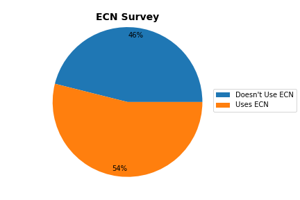

# ECN-Survey
A survey of various websites to check if they use ECN (Explicit Congestion Notification)

### How to Run

To run the test, type the following command into the terminal:-
`./ecn.sh`

### Logic 

During 3-way TCP Handshake, if receiver is ECN-Capable, then the ECE flag is set in the SYN+ACK packet. Thus, it is sufficient to check if the ECE flag is set in the SYN+ACK flag to check if a given website uses ECN.

### Result

According to a survey of 500 websites, 54% use ECN
